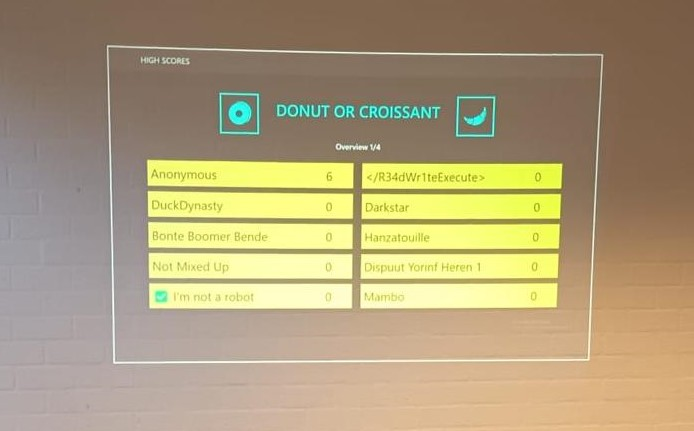

# ctf-2024-badge
Badge related files for CTC 2024 CTF

## Chef Badge

### Introduction

This year we made you a laser cut Chef Badge. This is a Badge of Honour to show off you participated in the hacking event of the year! On the back of the laser cut wood, you'll find a PCB (Printed Circuit Board) that contains a programmable microcontroller. The microcontroller is a NodeMCU ESP8266 and comes preflashed with MicroPython, a programming language targeted toward students and beginners that runs on top of embedded sytems.

### Game

The badge comes preloaded with a game "Donuts or Croissants", the favorite game of Chef Jasmijn. On the front, you'll find two push buttons (located on the right). 
- The top button allows to interact with the game. Short press for donut. Long press for croissant. 
- The lower button resets the microcontroller.

### Howto

If this is your first time tinkering with hardware, you might want to read this article about the [MicroPython REPL](https://docs.micropython.org/en/latest/esp8266/tutorial/repl.html). Connect your badge via USB and connect using a terminal program like `terminal-s`, `picocom`, or any others. Note that your badge comes preflashed with custom firmware already. If you accidentally overwrite it, you can ask us to reflash your badge.

### Hardware

The badge features a NodeMCU ESP8266, which comes with a 32-bit Tensilica L106 RISC processor and 4MB of RAM.
> The NodeMCU (Node MicroController Unit) is an open-source software and hardware development environment built around an inexpensive System-on-a-Chip (SoC) called the ESP8266\. The ESP8266, designed and manufactured by Espressif Systems, contains the crucial elements of a computer: CPU, RAM, networking (WiFi), and even a modern operating system and SDK. That makes it an excellent choice for Internet of Things (IoT) projects of all kinds. We've chosen this chip because it's hugely popular: there are many software libraries and examples that make it easy to get started with the ESP8266 and start building your own projects.

## Flashing

The `flasher.py` script is made for Windows and requires `esptool` and `ampy`. The team number of the badge should be supplied on the command line. E.g. `python3 flasher.py BT1` for flashing the badge of team number 1.

## Score board server

Teams should be loaded in `data.db`. There is an import script available (`import_runonce.py`). Or do some manual edits with an SQLite database browser.
Start the scoreboard server by running `python3 app.py`. The scoreboard server connects to an internal MQTT server (which should also be accessible to the badges) - alternatively, use a public one like emqx but without access control. The MQTT server files are for mosquitto. The `pwfile` contains hashed passwords for the team, it can be generated from `pwfile_orig` using `mosquitto_passwd -U passwordfile` which will hash all plaintext passes in the file to the hashed form.
